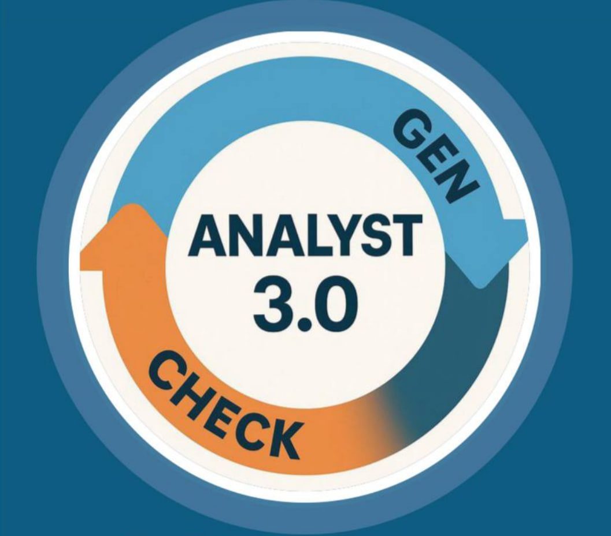

# Analyst 3.0 - Курс по аналитике и созданию AI-агента

## 📋 Описание курса

Курс **Analyst 3.0** представляет собой обучение современным методам и инструментам аналитики и **создание AI-агентов**. 

**🎯 Главная цель курса:** Создание полноценного AI-агента с веб-интерфейсом.

Курс охватывает весь жизненный цикл разработки от сбора требований до создания технической документации для AI-систем.

💡 [Оставить отзыв о курсе](https://t.me/biryukovaoly) - Ваше мнение поможет нам улучшить образовательный процесс.

✅ [Пример AI-агента](https://t.me/betttton_bot)

## 🎯 Цели курса

**🏆 Финальный результат:** Реализуете AI-агента и подготовите пакет требований к нему  

## 📚 Содержание курса

### **Бизнес анализ** 
1. **[User Stories](./01-User-Stories-Interface-Mockups-Use-Cases/materials/user-stories.md)** - Создание и работа с пользовательскими историями
2. **[Макеты интерфейсов](./01-User-Stories-Interface-Mockups-Use-Cases/materials/interface-mockups.md)** - Разработка прототипов и макетов
3. **[Сценарии использования](./01-User-Stories-Interface-Mockups-Use-Cases/materials/use-cases.md)** - Описание пользовательских сценариев
4. **[BPMN диаграммы](./01-User-Stories-Interface-Mockups-Use-Cases/materials/bpmn.md)** - Описание бизнес-процессов

### **Системный анализ** 
5. **[Архитектура системы](./materials/module2/system-architecture.md)** - Проектирование архитектуры
6. **[Модель данных](./materials/module3/data-modeling.md)** - Моделирование 
7. **[ER-диаграммы](./materials/module3/er-diagrams.md)** - Создание диаграмм "сущность-связь"
8. **[Sequence диаграммы](./materials/module4/sequence-diagrams.md)** - Построение взаимодействий
9. **[Документация API](./materials/module5/api-documentation.md)** - Создание технической документации
10. **[REST API](./materials/module5/rest-api.md)** - Проектирование API
11. **[Swagger](./materials/module6/swagger.md)** - Документирование API с помощью Swagger

### **Работа с LLM** 

12. **[LLM и GigaChat](./materials/module5/llm-gigachat.md)** - Работа с языковыми моделями

### **Финализация проекта** 
13. **[Критерии приемки и НФТ](./materials/module6/acceptance-criteria.md)** - Критерии приемки и нефункциональные требования
14. **[Резюме аналитика](./materials/module6/resume-writing.md)** - Как писать эффективные резюме
15. Финал проекта - демонстрация пакета документации и рабочего AI-агента

## 🤖 Практический проект: Создание AI-агента

### Описание проекта
В рамках курса каждый студент создает полноценный AI-агент, который включает:

**Технический стек:**
- 🔘 **Frontend:** Web-интерфейс или Telegram mini app
- 🔘 **Backend:** Python 
- 🔘 **LLM:** Напимер, GigaChat API
- 🔘 **Database:** PostgreSQL
- 🔘 **RAG:** Vector database для расширенной генерации

### Примеры AI-агентов
Доступно 10 готовых идей для проектов:
- HR AI ассистент для отбора кандидатов
- Маркетинг AI агент для создания контента
- CustDev AI агент для опросов пользователей
- Pitch-Deck AI Reviewer для анализа презентаций
- И другие...

📋 **[Подробнее о примерах AI-агентов](./src/examples/ai-agents/ai-agents-examples.md)**

## 🛠 Рекомендуемые инструменты

### Основные инструменты
- **Draw.io** - для создания диаграмм и макетов
- **stormbpmn и dbdiagram** - для BPMN и ER-диаграмм
- **PlantUML** - для UML диаграмм
- **Postman** - для тестирования API
- **Swagger Editor** - для документации API

## 📖 Литература и ресурсы

### Лекции

### Литература
1. [BABOK]() 
2. [UML ]()
3. [REST]()

## 🎓 Система оценивания

Для сдачи задания необходимо получить три ОК от пиров. Итоговый проект и документацию необходимо продемонстрировать экспертам. 

## 📞 Контакты

- **Analyst 3.0**: 
- [**Telegram**](https://t.me/biryukovaoly)

---

**Analyst 3.0** - Ваш путь к профессии аналитика! 🚀

